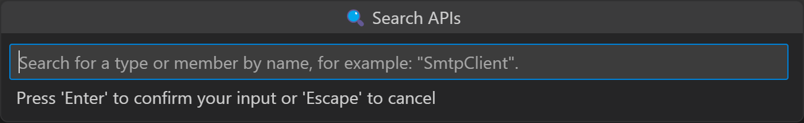
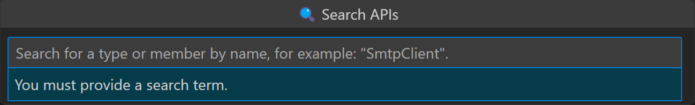
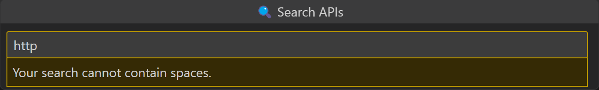
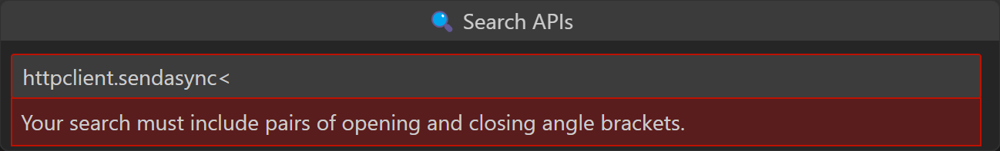
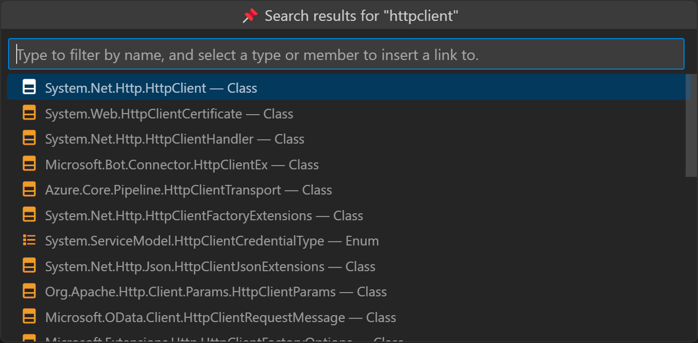
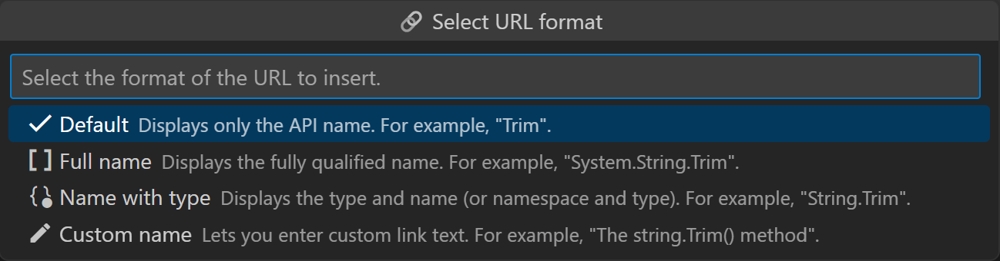
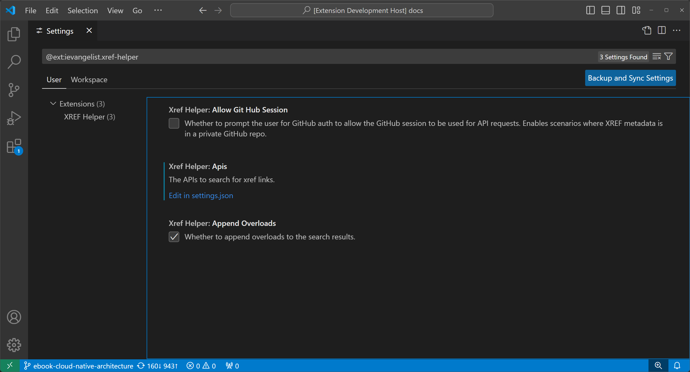

# 🔗 API Reference Link Helper

This extension helps content developers quickly insert and edit xref links to the official Microsoft API reference documentation for .NET types and members. It uses the [Microsoft Learn API Browser](https://learn.microsoft.com/api/apibrowser/dotnet/search) to search for a requested type or member. It exposes the ability to insert a markdown link to the markdown file open in the active editor. It supports the creation of links that display only the type or member name in the link text, type name with member name, fully qualified name, or custom text.

## Example Usage

Open the command palette <kbd>F1</kbd> and search for **Insert XREF Link**. Select the command, and when prompted, enter the type or member name you want to link to.

### Search validations

After you start typing, if you delete the text, there's a validation error that will appear. The extension will not allow you to insert an empty search term:

The search term cannot contain spaces:

The search term must include opening and closing bracket pairs:

After a valid search term is entered, the extension searches for the configured API and displays the most relevant results.

Once you select a result, you're prompted to choose the format of the link you want to insert.

Finally, the extension inserts the selected link format into the active editor.

## Getting Started

To install the extension, download the [latest _xref-helper.vsix_](https://github.com/IEvangelist/xref-helper/blob/main/dist/xref-helper.vsix) file from the _.dist/_ folder, and from Visual Studio Code, right-click the file and select _Install Extension VSIX_.

## Features

The following URL formats are supported, given the example `System.String.Format` method when selecting the [overloads option](#overloads-option) and **Method overloads** search result:

| Format | Resulting Markdown | Example HTML |
|--|--|--|
| Default | `<xref:System.String.Format*>` | `<a href="https://docs.microsoft.com/dotnet/api/system.string.format">Format</a>` |
| Full name | `<xref:System.String.Format*?displayProperty=fullName>` | `<a href="https://docs.microsoft.com/dotnet/api/system.string.format">System.String.Format</a>` |
| Name with type | `<xref:System.String.Format*?displayProperty=nameWithType>` | `<a href="https://docs.microsoft.com/dotnet/api/system.string.format">String.Format</a>` |
| Custom link text | `[The string.Format method](xref:System.String.Format*)` | `<a href="https://docs.microsoft.com/dotnet/api/system.string.format">The string.Format method</a>` |

_Command pallette commands:_

- **Insert XREF Link**: Inserts a markdown (`<xref:uid>`) link to the official Microsoft API reference documentation for the selected type or member.
- **Insert API Reference Link**: Inserts a markdown (`[Name](/link)`) link to the official Microsoft API reference documentation for the selected type or member.
- **Transform XREF to Other**: Convert XREF link between `` and `<xref:>`.

_Auto-completions:_

- **XREF Link Completion**: When typing `<xref:`, the extension will suggest the **Insert XREF Link** as a completion.
- **XREF Display Property Completion**: When typing `<xref:uid?`, the extension will suggest the possible display properties as completions.

_Code actions:_

- **XREF Display Property Switch**: The quick-edit code action (💡) is displayed when your cursor is on a line that contains an `xref` link with an existing display property, allowing you to quickly change the display property.

_Context menu commands:_

- **Convert XREF Link**: When a full `xref` link is selected, a context menu command is available to convert the link between `` and `<xref:>`.

## Requirements

- Visual Studio Code

## Extension Settings

In Visual Studio Code settings, search for `"XREF Helper"` (or paste this filter into the search bar `@ext:ievangelist.xref-helper`). You can configure the following settings:

| Setting | Description | Default |
|--|--|--|
| **Xref Helper: Api Url**   `xref-helper.apiUrl` | The URL to use when searching for XREFs. (Defaults to the .NET API search URL.) | `https://learn.microsoft.com/api/apibrowser/dotnet/search` |
| <a name="overloads-option" />**Xref Helper: Append Overloads**   `xref-helper.appendOverloads` | Whether to append overloads to the search results. Applies to methods and constructors. | `true` |
| **Xref Helper: Query String Parameters**   `xref-helper.queryStringParameters` | The query string parameters to include when searching for XREFs. | `[ { "name": "api-version", "value": "0.2" }, { "name": "locale", "value": "en-us" } ]` |

